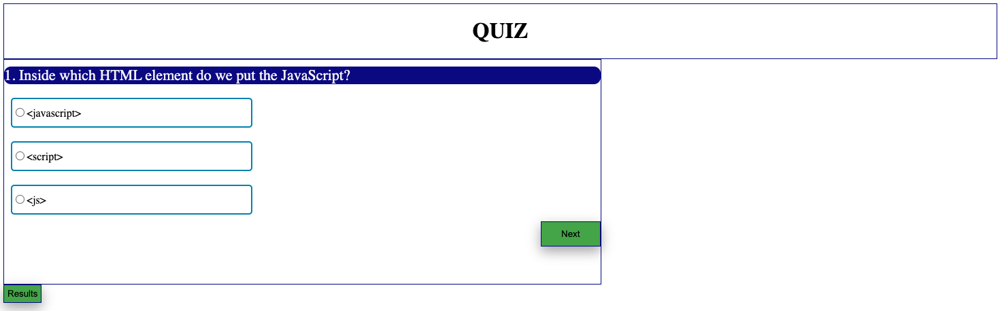
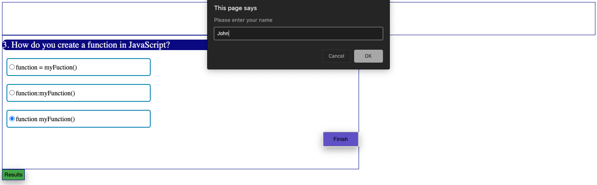
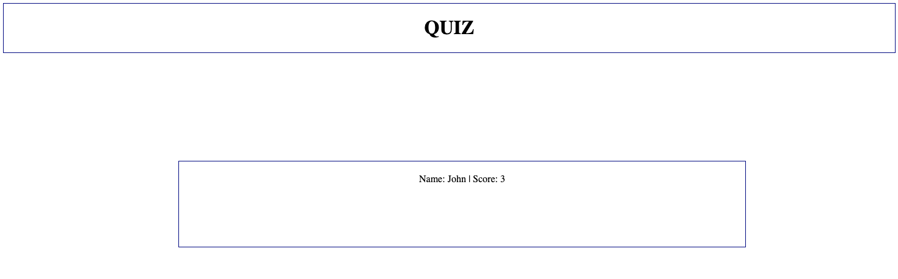

# **Javascript based Quiz Webpage**

## **Purpose**
JS Quiz Webpage that uses javascript, css and html to ask the user a series of javascript questions and report score at the end of the quiz.
This webpage also stores the last score wich can be accessed via the Results button.

## **Technologies Used**
* JS
* CSS
* HTML

## **URL**
https://sparshpatwa.github.io/ucb-04/

## **Screenshots**

## **Status**
Deployed using GITHUB
* TODO: Improve UI using CSS styling
